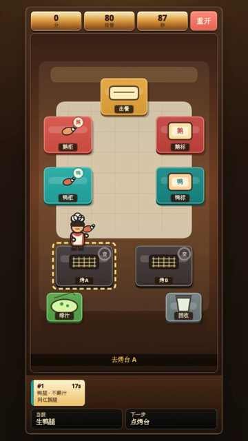

# 鹅鸭小厨房

一个适合手机竖屏玩的轻量 Canvas 小游戏：在小厨房里取鹅腿或鸭腿，烤熟、贴对标签，根据订单决定是否蘸秘制绿汁，然后出餐。

<p align="center">
  
</p>

## 在线试玩

[https://goose-duck-kitchen.netlify.app/](https://goose-duck-kitchen.netlify.app/)

GitHub Pages 备用试玩地址：

[https://shanedevpro.github.io/goose-duck-kitchen/](https://shanedevpro.github.io/goose-duck-kitchen/)

## 试玩视频

[查看竖屏试玩视频](demo/goose-duck-kitchen-demo.mp4)

视频内容包括两单流程：第一单鸭腿出餐，第二单鹅腿蘸绿汁后出餐。

## 游戏玩法

- 点台面移动，小厨师会自动走到目标位置。
- 从鹅柜或鸭柜取腿。
- 放到烤台，等到烤熟后取回。
- 按真实食材贴鹅标或鸭标。
- 按订单决定是否蘸绿汁：`要绿汁` 的订单需要去绿汁站蘸，`不蘸汁` 的订单不要蘸。
- 点出餐完成订单，争取更高分和信誉。

## 项目背景

本项目灵感来自公开讨论中的热搜事件，并把“鹅腿、鸭腿、标签、绿汁”等元素抽象成一个小游戏机制。游戏内容是轻量创作，不对现实事件、人物、食品安全或检测结论作事实判断。

## 技术栈

- Vanilla JavaScript
- Canvas 2D 渲染
- CSS 移动端布局
- Node.js 内置测试框架
- Playwright 移动端视觉 QA
- Netlify 静态部署

## 本地运行

```bash
npm install
npm run serve
```

然后打开：

```text
http://127.0.0.1:4173/
```

## 测试

运行规则测试和语法检查：

```bash
npm run check
```

运行移动端视觉 QA：

```bash
QA_SCREENSHOT_MODE=abstract npm run qa:mobile
```

移动 QA 会在 `/tmp` 输出截图，用于检查竖屏布局、基础流程和遮挡问题。

## 开源与素材授权

本项目使用 MIT License 开源。代码和 `assets/game/` 中已提交的 PNG 游戏素材均随项目按 MIT License 授权。

`assets/raw/`、`assets/concepts/`、`.netlify/`、`node_modules/` 等目录属于本地生成或工具状态，不包含在开源包中。

`demo/goose-duck-kitchen-demo.mp4` 是有意包含的演示视频，随项目按 MIT License 授权。
